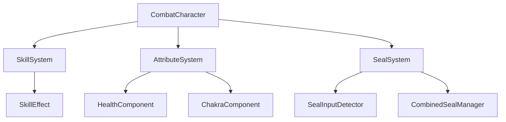

---
name: 双心印战斗系统开发计划
overview: 基于UE5开发双心印项目的实时动作战斗系统，包含结印、合印、技能连招等核心玩法，优先实现单机版本。
todos:
  - id: remove-old-plan
    content: 删除现有项目开发计划文档
    status: completed
  - id: explore-combat-system
    content: 使用 [subagent:code-explorer] 深入分析现有Variant_Combat系统架构
    status: completed
  - id: create-attribute-system
    content: 创建角色属性系统（生命值、查克拉、攻击力等组件）
    status: completed
    dependencies:
      - explore-combat-system
  - id: implement-seal-system
    content: 实现结印系统（输入检测、结印数据、执行逻辑）
    status: completed
    dependencies:
      - create-attribute-system
  - id: develop-skill-system
    content: 开发技能系统（技能组件、效果系统、数据管理）
    status: completed
    dependencies:
      - implement-seal-system
  - id: create-combined-seal
    content: 实现合印系统（双人协作、组合技能管理）
    status: completed
    dependencies:
      - develop-skill-system
  - id: integrate-combat-ui
    content: 集成战斗UI（技能栏、属性条、结印指示器）
    status: completed
    dependencies:
      - create-combined-seal
  - id: generate-new-plan
    content: 生成新的双心印战斗系统开发计划文档
    status: completed
    dependencies:
      - integrate-combat-ui
---

## 用户需求

删除原有项目开发计划文档，重新制定专注于双心印战斗系统的开发计划

## 产品概述

双心印是一款基于UE5开发的实时动作战斗游戏，核心玩法围绕结印系统和双人合作战斗展开。项目将在现有CombatCharacter基础架构上扩展，实现更丰富的战斗机制。

## 核心功能

- **基础1v1战斗系统**：在现有连击和蓄力攻击基础上优化战斗手感
- **结印系统**：玩家通过特定手势或按键组合释放忍术技能
- **合印系统**：双人协作释放更强大的组合技能
- **技能连招系统**：支持技能与普攻的流畅连接
- **角色属性系统**：包含生命值、查克拉值、攻击力、防御力等属性

## 技术栈选择

- **游戏引擎**：UE5.6（现有项目基础）
- **编程语言**：C++（核心逻辑）+ Blueprint（快速原型和UI）
- **网络框架**：暂不考虑（单机优先）
- **插件依赖**：StateTree（状态管理）、GameplayStateTree（游戏玩法状态）

## 实现方案

基于现有的Variant_Combat架构进行扩展开发，保持代码结构的一致性和可维护性。采用接口驱动设计，通过ICombatAttacker和ICombatDamageable接口扩展新功能。

### 核心技术决策

1. **结印系统**：使用输入序列检测 + 状态机管理结印流程
2. **合印系统**：通过事件系统实现双角色协调
3. **属性系统**：扩展现有HP系统，添加查克拉和其他属性
4. **技能系统**：基于AnimMontage + GameplayAbility模式

## 实现细节

- **性能优化**：结印输入检测使用时间窗口机制，避免频繁计算
- **状态管理**：利用StateTree插件管理复杂的战斗状态转换
- **内存管理**：技能效果使用对象池模式，减少GC压力
- **调试支持**：添加详细的日志系统和可视化调试工具

## 架构设计

### 系统架构

采用分层架构模式：

- **表现层**：UI界面、特效、动画
- **逻辑层**：战斗系统、技能系统、属性系统
- **数据层**：配置数据、存档系统



## 目录结构

```
twohearts/Source/twohearts/Variant_Combat/
├── Combat/
│   ├── CombatCharacter.h/cpp          # [MODIFY] 扩展现有战斗角色类
│   ├── CombatGameMode.h/cpp           # [MODIFY] 添加战斗模式管理
│   └── CombatPlayerController.h/cpp   # [MODIFY] 扩展玩家控制器
├── Systems/
│   ├── AttributeSystem/
│   │   ├── AttributeComponent.h/cpp   # [NEW] 角色属性组件
│   │   ├── HealthComponent.h/cpp      # [NEW] 生命值组件
│   │   └── ChakraComponent.h/cpp      # [NEW] 查克拉组件
│   ├── SkillSystem/
│   │   ├── SkillComponent.h/cpp       # [NEW] 技能系统组件
│   │   ├── SkillData.h/cpp            # [NEW] 技能数据结构
│   │   └── SkillEffect.h/cpp          # [NEW] 技能效果基类
│   └── SealSystem/
│       ├── SealComponent.h/cpp        # [NEW] 结印系统组件
│       ├── SealInputDetector.h/cpp    # [NEW] 结印输入检测器
│       ├── SealData.h/cpp             # [NEW] 结印数据结构
│       └── CombinedSealManager.h/cpp  # [NEW] 合印管理器
├── Interfaces/
│   ├── CombatAttacker.h               # [MODIFY] 扩展攻击接口
│   ├── CombatDamageable.h             # [MODIFY] 扩展受伤接口
│   ├── SkillCaster.h                  # [NEW] 技能释放接口
│   └── SealPerformer.h                # [NEW] 结印执行接口
├── Data/
│   ├── SkillDataTable.h/cpp           # [NEW] 技能数据表
│   ├── SealDataTable.h/cpp            # [NEW] 结印数据表
│   └── AttributeDataTable.h/cpp       # [NEW] 属性数据表
└── UI/
    ├── CombatHUD.h/cpp                # [NEW] 战斗界面HUD
    ├── SkillBar.h/cpp                 # [NEW] 技能栏UI
    └── AttributeBar.h/cpp             # [NEW] 属性条UI
```

## 关键代码结构

### 结印系统接口

```cpp
UINTERFACE(MinimalAPI, BlueprintType)
class USealPerformer : public UInterface
{
    GENERATED_BODY()
};

class ISealPerformer
{
    GENERATED_BODY()

public:
    UFUNCTION(BlueprintCallable, Category="Seal")
    virtual bool PerformSeal(const FSealData& SealData) = 0;
    
    UFUNCTION(BlueprintCallable, Category="Seal")
    virtual bool CanPerformSeal(const FSealData& SealData) const = 0;
    
    UFUNCTION(BlueprintCallable, Category="Seal")
    virtual void OnSealCompleted(const FSealData& SealData) = 0;
};
```

### 技能数据结构

```cpp
USTRUCT(BlueprintType)
struct FSkillData
{
    GENERATED_BODY()

    UPROPERTY(EditAnywhere, BlueprintReadWrite)
    FName SkillID;
    
    UPROPERTY(EditAnywhere, BlueprintReadWrite)
    float ChakraCost;
    
    UPROPERTY(EditAnywhere, BlueprintReadWrite)
    float Cooldown;
    
    UPROPERTY(EditAnywhere, BlueprintReadWrite)
    TArray<FSealData> RequiredSeals;
};
```

## 代理扩展

### SubAgent

- **code-explorer**
- 目的：深入探索现有Variant_Combat模块的代码结构和实现细节
- 预期结果：全面了解现有战斗系统的架构，为扩展开发提供准确的技术基础