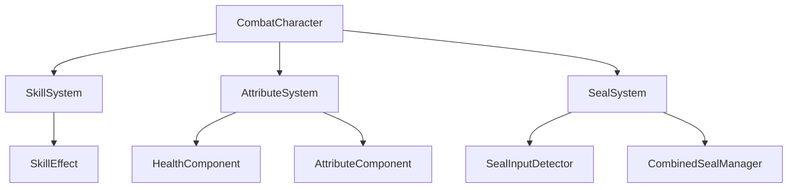

# 双心印战斗系统开发计划

## 项目概述

双心印是一款基于UE5开发的实时动作战斗游戏，核心玩法围绕结印系统和双人合作战斗展开。本开发计划专注于战斗系统的核心功能实现，优先开发单机版本，为后续联机功能奠定基础。

## 核心功能需求

### 1. 基础1v1战斗系统
- 在现有CombatCharacter连击和蓄力攻击基础上优化战斗手感
- 保持现有的接口驱动架构（ICombatAttacker、ICombatDamageable）
- 扩展攻击类型和连击系统
- 优化碰撞检测和物理反馈

### 2. 结印系统
- 玩家通过特定按键组合释放忍术技能
- 支持输入序列检测和时间窗口验证
- 结印动画与技能效果的联动
- 结印失败和成功的反馈机制

### 3. 合印系统
- 双人协作释放更强大的组合技能
- 距离和时机同步检测
- 合印威力加成和特殊效果
- 伙伴匹配和邀请机制

### 4. 技能连招系统
- 支持技能与普攻的流畅连接
- 技能优先级和打断机制
- 连招缓存和输入容错
- 动画融合和状态管理

### 5. 角色属性系统
- 生命值、攻击力、防御力等基础属性
- 属性变化事件和UI反馈
- 属性缩放和计算系统
- 升级和成长机制

## 技术架构设计

### 技术栈选择
- **游戏引擎**：UE5.6（现有项目基础）
- **编程语言**：C++（核心逻辑）+ Blueprint（快速原型和UI）
- **网络框架**：暂不考虑（单机优先）
- **插件依赖**：StateTree（状态管理）、Enhanced Input System（输入处理）

### 系统架构
采用分层架构模式：
- **表现层**：UI界面、特效、动画
- **逻辑层**：战斗系统、技能系统、属性系统
- **数据层**：配置数据、存档系统



### 目录结构规划
```
twohearts/Source/twohearts/Variant_Combat/
├── Combat/
│   ├── CombatCharacter.h/cpp          # [MODIFY] 扩展现有战斗角色类
│   ├── CombatGameMode.h/cpp           # [MODIFY] 添加战斗模式管理
│   └── CombatPlayerController.h/cpp   # [MODIFY] 扩展玩家控制器
├── Systems/
│   ├── AttributeSystem/
│   │   ├── AttributeComponent.h/cpp   # [NEW] 角色属性组件
│   │   └── HealthComponent.h/cpp      # [NEW] 生命值组件
│   ├── SkillSystem/
│   │   ├── SkillComponent.h/cpp       # [NEW] 技能系统组件
│   │   ├── SkillData.h/cpp            # [NEW] 技能数据结构
│   │   └── SkillEffect.h/cpp          # [NEW] 技能效果基类
│   └── SealSystem/
│       ├── SealComponent.h/cpp        # [NEW] 结印系统组件
│       ├── SealInputDetector.h/cpp    # [NEW] 结印输入检测器
│       ├── SealData.h/cpp             # [NEW] 结印数据结构
│       └── CombinedSealManager.h/cpp  # [NEW] 合印管理器
├── Interfaces/
│   ├── CombatAttacker.h               # [MODIFY] 扩展攻击接口
│   ├── CombatDamageable.h             # [MODIFY] 扩展受伤接口
│   ├── SkillCaster.h                  # [NEW] 技能释放接口
│   └── SealPerformer.h                # [NEW] 结印执行接口
├── Data/
│   ├── SkillDataTable.h/cpp           # [NEW] 技能数据表
│   ├── SealDataTable.h/cpp            # [NEW] 结印数据表
│   └── AttributeDataTable.h/cpp       # [NEW] 属性数据表
└── UI/
    ├── CombatHUD.h/cpp                # [NEW] 战斗界面HUD
    ├── SkillBar.h/cpp                 # [NEW] 技能栏UI
    └── AttributeBar.h/cpp             # [NEW] 属性条UI
```

## 开发阶段规划

### 第一阶段：基础系统扩展（2-3周）
**目标**：扩展现有战斗系统，添加属性管理

**任务清单**：
- [ ] 分析现有CombatCharacter架构
- [ ] 设计AttributeComponent组件
- [ ] 实现HealthComponent专用组件
- [ ] 扩展ICombatDamageable接口
- [ ] 集成属性变化事件系统
- [ ] 更新现有战斗逻辑以使用新属性系统

**交付物**：
- 完整的属性系统组件
- 更新后的战斗角色类
- 属性变化的UI反馈

### 第二阶段：结印系统实现（3-4周）
**目标**：实现完整的结印输入检测和执行系统

**任务清单**：
- [ ] 设计结印数据结构（FSealData）
- [ ] 实现SealInputDetector输入检测器
- [ ] 创建SealComponent主控组件
- [ ] 集成Enhanced Input System
- [ ] 实现结印动画系统
- [ ] 添加结印效果和反馈
- [ ] 创建结印配置数据表

**交付物**：
- 完整的结印系统
- 结印输入检测机制
- 结印动画和效果系统
- 结印配置工具

### 第三阶段：技能系统开发（3-4周）
**目标**：构建灵活的技能释放和效果系统

**任务清单**：
- [ ] 设计技能数据结构（FSkillData）
- [ ] 实现SkillComponent技能管理器
- [ ] 创建SkillEffect效果处理系统
- [ ] 集成结印与技能的关联
- [ ] 实现技能冷却和状态管理
- [ ] 添加技能动画和特效
- [ ] 创建技能配置数据表

**交付物**：
- 完整的技能系统
- 技能效果处理框架
- 技能与结印的集成
- 技能配置工具

### 第四阶段：合印系统实现（4-5周）
**目标**：实现双人协作的合印机制

**任务清单**：
- [ ] 设计合印数据结构（FCombinedSealData）
- [ ] 实现CombinedSealManager管理器
- [ ] 创建伙伴匹配和邀请系统
- [ ] 实现同步检测和时机验证
- [ ] 添加合印动画和特效
- [ ] 实现合印威力加成系统
- [ ] 创建合印配置数据表

**交付物**：
- 完整的合印系统
- 伙伴协作机制
- 合印同步检测
- 合印配置工具

### 第五阶段：UI系统集成（2-3周）
**目标**：完善战斗相关的用户界面

**任务清单**：
- [ ] 扩展现有CombatLifeBar
- [ ] 创建SkillBar技能栏UI
- [ ] 实现AttributeBar属性显示
- [ ] 添加结印指示器UI
- [ ] 创建合印邀请界面
- [ ] 实现冷却时间显示
- [ ] 优化UI响应性能

**交付物**：
- 完整的战斗UI系统
- 属性和状态显示
- 技能和结印界面
- 合印协作UI

### 第六阶段：系统整合和优化（2-3周）
**目标**：整合所有系统，优化性能和体验

**任务清单**：
- [ ] 系统间接口整合测试
- [ ] 性能分析和优化
- [ ] 内存管理优化
- [ ] 网络架构预留设计
- [ ] 错误处理和容错机制
- [ ] 调试工具和日志系统
- [ ] 文档编写和代码注释

**交付物**：
- 完整集成的战斗系统
- 性能优化报告
- 技术文档
- 调试和维护工具

## 技术实现要点

### 1. 接口驱动设计
- 保持现有ICombatAttacker、ICombatDamageable接口
- 新增ISkillCaster、ISealPerformer接口
- 确保系统间松耦合

### 2. 事件驱动架构
- 使用UE的委托系统实现事件通信
- 属性变化、技能释放、结印完成等关键事件
- 支持Blueprint和C++双向绑定

### 3. 数据驱动配置
- 技能、结印、属性通过数据表配置
- 支持热更新和运行时修改
- 版本控制友好的配置格式

### 4. 性能优化策略
- 对象池管理技能效果
- 输入检测使用时间窗口机制
- UI更新采用事件驱动而非轮询

### 5. 扩展性考虑
- 预留网络同步接口
- 模块化设计便于功能扩展
- 支持自定义技能和结印

## 风险评估与应对

### 技术风险
- **输入检测精度**：采用时间窗口和容错机制
- **动画同步复杂性**：使用StateTree管理复杂状态
- **性能瓶颈**：早期性能测试和优化

### 开发风险
- **系统复杂度**：分阶段开发，逐步集成
- **接口兼容性**：保持现有架构，渐进式扩展
- **测试覆盖度**：每个阶段完成后进行集成测试

### 时间风险
- **功能蔓延**：严格按照需求范围开发
- **技术债务**：定期代码重构和优化
- **集成问题**：预留充足的集成测试时间

## 成功标准

### 功能完整性
- [ ] 所有核心功能按需求实现
- [ ] 系统间集成无缝衔接
- [ ] UI响应流畅直观

### 性能指标
- [ ] 帧率稳定在60FPS以上
- [ ] 输入延迟小于50ms
- [ ] 内存使用控制在合理范围

### 代码质量
- [ ] 代码覆盖率达到80%以上
- [ ] 无严重性能和内存泄漏问题
- [ ] 代码结构清晰，注释完整

### 用户体验
- [ ] 战斗手感流畅自然
- [ ] 结印操作简单易学
- [ ] 合印协作有趣有挑战性

## 后续扩展规划

### 联机功能
- 网络同步架构设计
- 延迟补偿和预测回滚
- 反作弊和安全机制

### 内容扩展
- 更多结印和技能类型
- 角色职业和专精系统
- 装备和道具系统

### 平衡性调优
- 数据驱动的平衡性调整
- 玩家行为数据分析
- 持续的游戏性优化

---

**文档版本**：v1.0  
**创建日期**：2026年2月10日  
**最后更新**：2026年2月10日  
**负责人**：开发团队